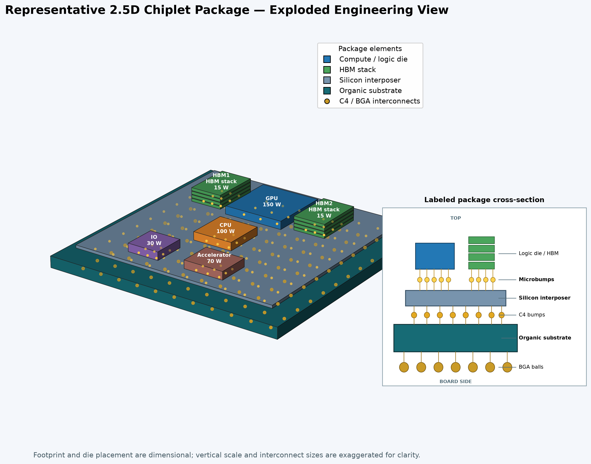
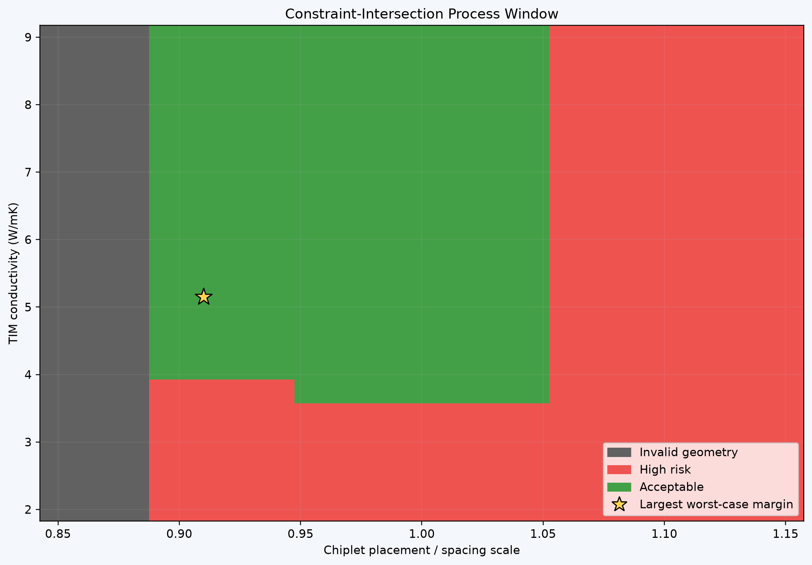
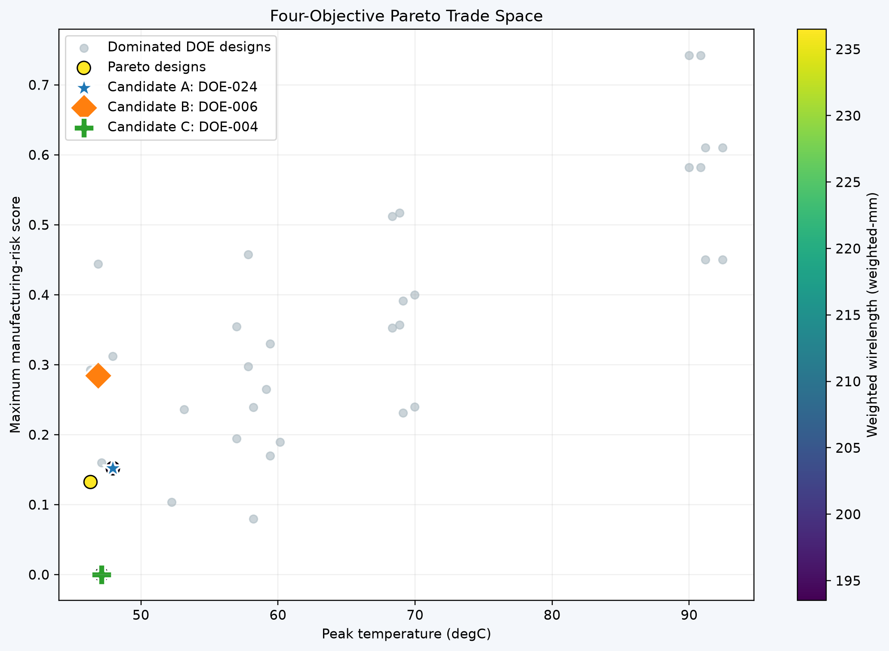

# Advanced Packaging Engineering Project Showcase

This repository presents two explainable engineering projects developed to support an R&D transition from legacy semiconductor packaging toward advanced packaging integration. The public material shows the engineering questions, methods, selected results, and model limitations without publishing the private implementation, raw data, supplier records, or detailed technical reports.

| Project | Engineering purpose | Public artifact |
|---|---|---|
| 2.5D Chiplet Process Window | Screen early package-design choices across thermal, thermo-mechanical, layout, and manufacturing constraints | Selected figures and [portfolio poster](portfolio/Chiplet_Process_Window_Poster.pdf) |
| Molding Compound Selection Workbench | Compare EMC and molded-underfill candidates using datasheet evidence, package requirements, hard gates, mold trials, and reliability evidence | High-level methodology and [interactive demonstration](https://package-materials-workbench.aravin397.chatgpt.site/) |

## Project 1 — 2.5D Chiplet Package Process Window

This Python-based reduced-order study connects chiplet placement, thermal response, a thermo-mechanical screening proxy, manufacturing-risk indicators, design of experiments, statistical diagnostics, Pareto tradeoffs, and a multi-constraint process window.

The first-order design levers are chiplet placement scale, thermal-interface-material conductivity, silicon-interposer thickness, total chiplet power scale, and microbump pitch. They represent geometry, thermal performance, mechanical and handling sensitivity, operating load, and interconnect density.



The representative baseline contains six chiplets on a silicon interposer and organic substrate. It reports a 60.16 °C peak temperature, 2.936 MPa maximum stress proxy, 0.189 maximum comparative manufacturing-risk score, and 215 weighted-mm routing metric.



The illustrated 441-point study classifies 172 points as acceptable, 206 as high risk, and 63 as invalid geometry under the project’s illustrative constraints.



## Project 2 — Molding Compound Selection Workbench

This browser-based decision-support tool structures EMC and molded-underfill selection for legacy and advanced packages. It uses user-entered package requirements, supplier datasheet properties, evidence completeness, mold-trial observations, and reliability results. All limits remain editable because acceptable behavior depends on package architecture, materials, geometry, tooling, and process conditions.

Selection follows noncompensatory stage gates:

- **G1 — Identity and compliance:** exact grade, supplier, revision, intended application, regulatory status, and traceable source.
- **G2 — Material-property evidence:** relevant filler, cure, rheology, thermal, mechanical, moisture, adhesion, ionic, electrical, storage, and processing information.
- **G3 — Package mold trial:** every defined criterion must pass, including applicable flow, fill, wire sweep, void, flash, bleed, short-shot, surface, dimension, and post-mold-cure responses.
- **G4 — Interface and reliability evidence:** applicable preconditioning, moisture sensitivity, reflow, delamination inspection, temperature cycling, high-temperature storage, biased humidity, and package-specific tests.

For an upper-limit observation `y_rj` and limit `L_j`, the normalized trial margin is:

```text
m_rj = (L_j - y_rj) / max(|L_j|, 1)
```

Passing-run yield and worst passing margin are:

```text
Y = N_pass / N_evaluated
m_worst = min(m_rj) across all passing observations
```

Candidates are ordered first by gate-based disposition, then by passing-run yield, worst passing margin, and represented sample count. A strong thermal property cannot compensate for a failed mandatory reliability or moldability gate. Missing information remains **Not Tested** rather than being converted into an optimistic score.

Useful physics relationships guide screening and DOE priorities:

```text
Filler-to-gap ratio:  phi = D_max / g_min
Modulus retention:    r_E = E_hot / E_25
CTE mismatch strain:  epsilon_th = (alpha_EMC - alpha_adjacent) delta_T
Wire-sweep tendency:  deflection proportional to F_drag L_wire^3 / (E_wire I)
Thermal diffusivity:  a = k / (rho c_p)
```

The model does not claim to predict absolute warpage, delamination probability, MSL level, void size, or wire sweep from a datasheet alone. Those outcomes require package geometry, adjacent-material properties, interface condition, process history, and physical evidence. The tool supports transparent shortlisting and trial planning; it does not replace qualification.

## Public/private boundary

This public repository contains selected figures, a portfolio poster, a high-level methodology, and links to the demonstration. The source code, detailed equations and derivations, editable configurations, raw result tables, supplier records, full technical reports, and private collaboration history remain in the private development repository.

## Author

Developed and maintained by [Aravind5055](https://github.com/Aravind5055). See [NOTICE.md](NOTICE.md) for usage terms.
